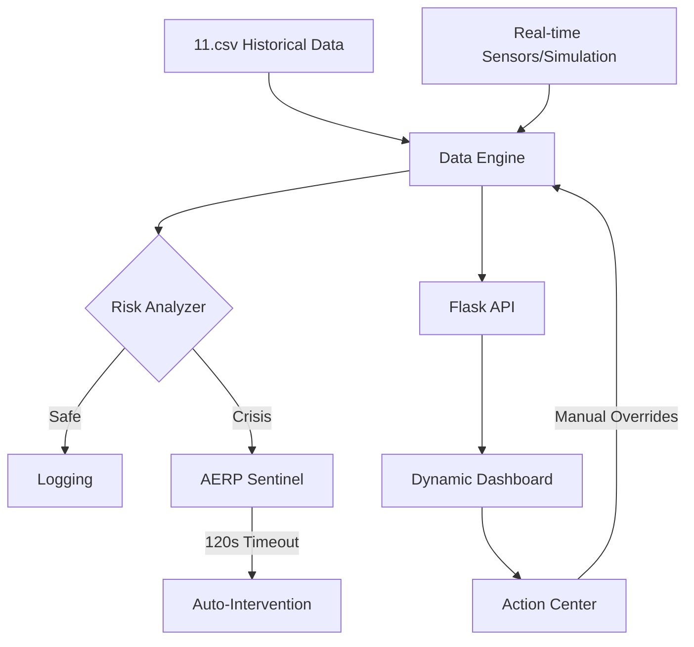

# Suraksha Drishti 🛡️
### AI-Powered Stampede Window Predictor for Gujarat's Pilgrimage Corridors


[](https://www.python.org/)
[](https://flask.palletsprojects.com/)
[](https://github.com/vraj256/SurakshaDrishti)

## 🌟 Overview

**Suraksha Drishti** (Protection Vision) is a state-of-the-art predictive analytics dashboard designed to solve one of the most critical safety challenges in religious tourism: **Stampede Prevention**. 

By processing real-time telemetry from temple corridors—including inflow rates, corridor bottlenecks, crowd density, and public transport surges—the system provides a **15-minute predictive window**, allowing authorities to intervene *before* a crisis manifests.

---

## 🚀 Key Technical Pillars

### 1. Corridor Pressure Index (CPI)
At the heart of Suraksha Drishti is the **CPI**, a multi-variate pressure metric that calculates the physical risk level of a corridor segment.
$$CPI = \left(\frac{Inflow}{Width} \times 1.2\right) + (Density \times 14) + (Transport \times 1.5)$$
*   **Safe (<30):** Normal operations.
*   **Warning (30-55):** Increasing density; monitor closely.
*   **Danger (55-75):** Immediate risk; manual intervention required.
*   **Critical (>75):** Extreme risk; emergency protocols triggered.

### 2. Autonomous Escalation Protocol (AERP-120)
The system features a "Sentinel" logic. If a corridor remains in **Danger** or **Critical** status for more than **120 seconds** without manual acknowledgement, the AI autonomously executes mitigation protocols:
-   🛑 **Transport Halt**: Stops incoming bus/shuttle waves.
-   🔀 **Crowd Diversion**: Activates alternate gate routing.
-   🎫 **Managed Entry**: Switches to batch-token entry flow.

### 3. Predictive Intelligence
Using historical trend analysis (Polynomial Regression) on live telemetry, the system predicts the CPI 15 minutes into the future, providing a "Golden Window" for pre-emptive action.

---

## 🏗️ System Architecture



---

## 📂 Project Structure

```text
📦 suraksha-drishti
 ┣ 📂 backend                # Python Flask Application Logic
 ┃ ┣ 📜 app.py               # Core API, AERP Sentinel, and State Management
 ┃ ┗ 📜 data_engine.py       # Data Analysis, CPI Calculation, and Prediction
 ┣ 📂 data                   # Raw Datasets and Historical Backups
 ┃ ┣ 📜 11.csv               # Primary telemetry dataset (Inflow, Density, etc.)
 ┃ ┗ 📜 11_backup_random.csv # Secondary backup dataset
 ┣ 📂 frontend               # Web Dashboard (Digital Twin Interface)
 ┃ ┣ 📂 static               # High-fidelity Assets (CSS, JS, Icons)
 ┃ ┗ 📂 templates            # HTML Structure (Jinja2 Templates)
 ┣ 📜 .gitignore             # Environment and internal cache exclusions
 ┣ 📜 requirements.txt       # Python dependency manifest
 ┗ 📜 README.md              # Project Technical Documentation
```

---

## 🛠️ Installation & Setup

### Prerequisites
- Python 3.8+
- Modern Web Browser (Chrome/Edge/Brave)

### Steps
1. **Clone & Install Dependencies**
   ```bash
   pip install -r requirements.txt
   ```

2. **Launch the Command Center**
   ```bash
   cd backend
   python app.py
   ```

3. **Access the Dashboard**
   Navigate to `http://127.0.0.1:5000` in your browser.

---

## 📊 Dataset & Simulation
The project utilizes a specialized dataset (`11.csv`) containing millions of data points from pilgrimage corridors in Gujarat (Ambaji, Dwarka, Somnath, Pavagadh). 

- **Replay Mode**: Allows judges to see how the system would have performed during historical peak surges.
- **Stress Test Simulator**: Allows manual injection of "General Surges", "Transport Waves", or "Density Spikes" to validate the AERP logic.

---

## 🛡️ Impact Team
Developed for high-impact public safety during major festivals and peak pilgrimage seasons.

> **"Turning Reactive Response into Proactive Prevention."**
